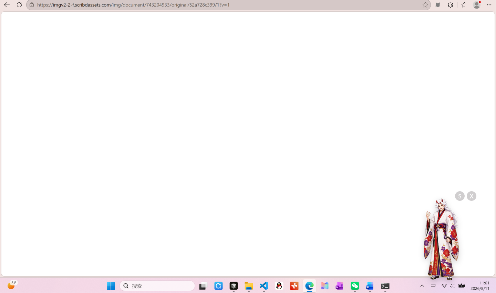
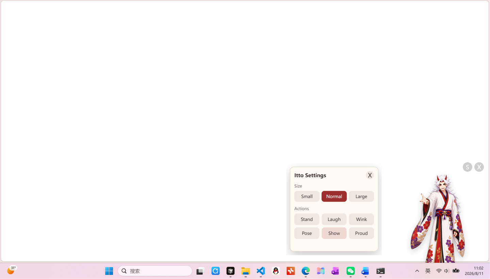
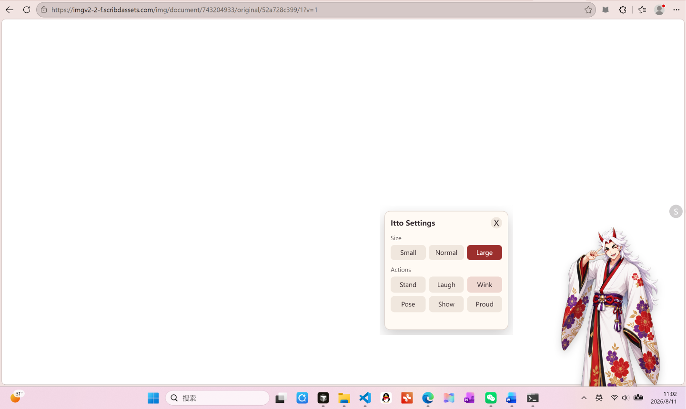
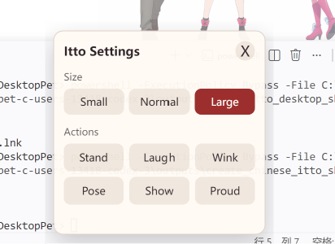
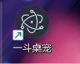

# Arataki Itto DesktopPet

一款基于 Electron 的原神荒泷一斗桌宠插件，支持透明桌面悬浮、自由调整大小、切换动作，并可生成桌面快捷方式。

## 功能亮点

- 透明桌面宠物，保持桌面整洁
- 支持自由调整宠物大小
- 多种动作效果，画面更生动
- 可生成桌面快捷方式，快速启动

## 安装与运行

1. 克隆仓库或下载源码。
2. 在项目根目录打开终端，运行：

```bash
npm install
npm start
```

## 演示截图

### 1. 小尺寸



### 2. 中尺寸



### 3. 大尺寸



### 4. 调整大小与动作



### 5. 桌面快捷方式



## 项目说明

- 入口文件：`src/main.js`
- 渲染页面：`src/renderer.html`
- 预加载脚本：`src/preload.js`
- 桌宠样式与设置位于 `src/styles.css` 和 `src/settings.css`

## 依赖

- Electron

## 开发者提示

如果你想修改宠物动作或者大小展示，可直接编辑 `src/renderer.js` 中的动画逻辑。